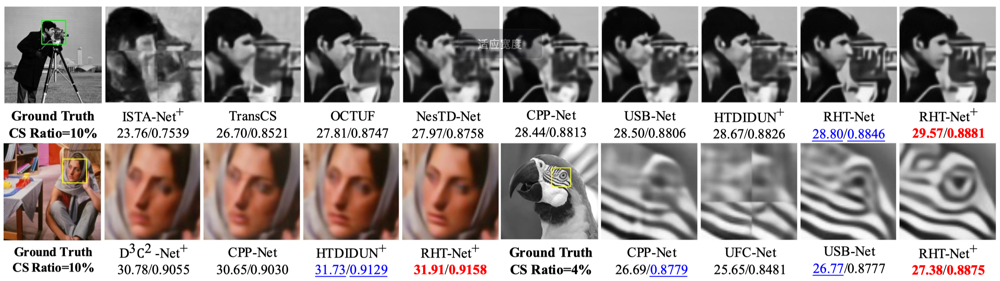

# RHT-Net

Representation Sampling and Hybrid Transformer Network for Image Compressed Sensing

Heping Song; Jingyao Gong; Hongjie Jia; Xiangjun Shen; Jianping Gou; Hongying Meng; Le Wang

IEEE Transactions on Circuits and Systems for Video Technology ( Early Access )

[DOI](https://doi.org/10.1109/TCSVT.2025.3614371)

## Abstract

Deep unfolding networks (DUNs) have attracted significant attention in the field of 
image compressed sensing (CS) due to its superior performance and good explainability 
by integrating optimization algorithms with deep networks.
However, existing DUNs suffer from low sampling efficiency, and the improvement in 
reconstruction quality heavily relies on a large number of parameters, although this is not necessary.
To address these issues, we propose a Representation Sampling and Hybrid Transformer Network (RHT-Net).
We innovatively design a Representation-CS (RCS) model to extract high-level signal representations, 
sampling highly dense and semantically rich, extremely compact features without relying on observing the original pixels, 
which also reduces the cross-domain loss during fidelity term correction.
In the deep recovery stage, we design a 
Tri-Scale Sparse Denoising (TSSD) module to extend sparse proximal projections, 
leveraging multi-scale auxiliary variables to enhance multi-feature flow and memory effects.
Subsequently, we develop a hybrid Transformer that includes Global Cross Attention (GCA) 
and Window Local Attention (WLA), using the measurements to cross-estimate the reconstruction error, 
thereby generating finer spatial information and local recovery.
Experiments demonstrate that RHT-Net outperforms existing SOTA methods by up to 1.17dB in PSNR.
Furthermore, RHT-Net-light achieves a 0.43dB gain while reducing model parameters by up to 22 times, 
underscoring the superior efficiency of our approach.

## Network Architecture


## Requirements (recommend)
- Python >= 3.9
- Pytorch >= 2.1.2
- Numpy >= 1.26


## Datasets
- Train data: crop from [BSDS](https://www2.eecs.berkeley.edu/Research/Projects/CS/vision/grouping/resources.html) dataset.
- Test data: from Urban100, Set11, BSDS200, DIV2K.
- Should decompress and place these datasets in the "./dataset/" directory.
- (We will make the training and testing datasets publicly available when permitted)

## Pre training model
We provide [pre-trained weights](https://files.catbox.moe/gneu18.zip) (Completely anonymous, decompression password ` 2025cvpr`) 
for convenient evaluation. It contains six sampling rates.

## Quick Start

### Test
1. Ensure the test dataset path in data_processor.py is correct.
2. Ensure that the `trained_model` directory contains the pre-trained model weight files.
3. Run the following scripts to test RHT-Net model:
    ```
    python eval_rht.py
    ```


### Train

1. Ensure the train dataset path in data_processor.py is correct.
2. Run the following scripts to train RHT-Net model:
    ```
    python train.py --epochs 150 --batch-size 16
    ```


## Results

### Quantitative Results




